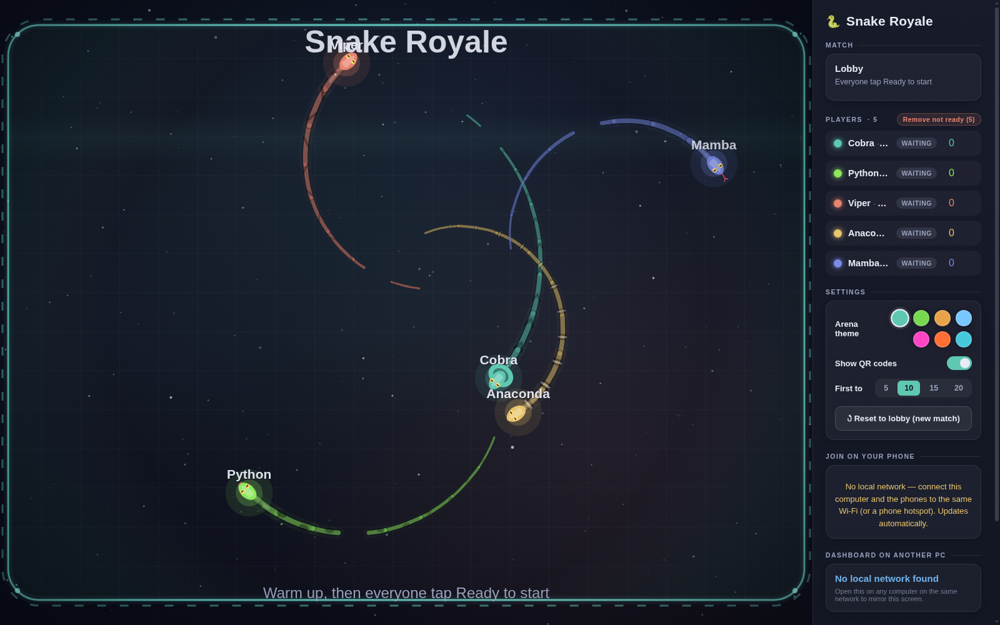
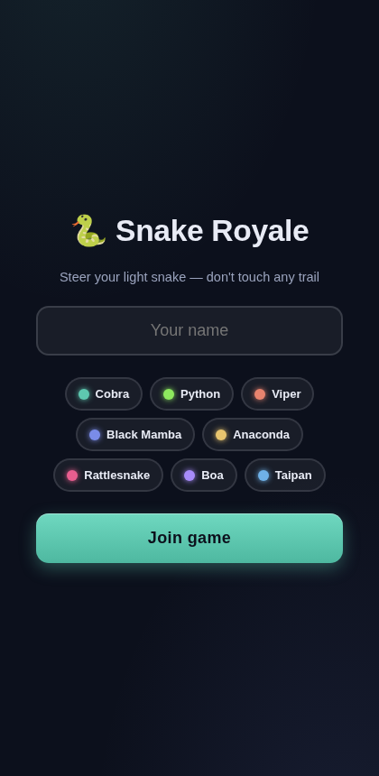

# Snake Royale

A local party game for a big screen and everyone's phones. One laptop or PC runs the arena on a TV or projector, everyone else joins by scanning a QR code with their phone, and their phone becomes a joystick. Steer your snake, dodge every trail (including your own), grab power-ups, and outlast the pack — last snake standing each round scores points, first to the target score wins the match. No apps to install, no accounts, just the same Wi-Fi.

## Screenshots

**Arena (big screen / dashboard)**



**Phone controller**



## How to run it

1. Install [Node.js](https://nodejs.org) (v18 or newer) if you don't have it already.
2. Download or clone this repo, then open a terminal in the folder.
3. Install dependencies:
   ```
   npm install
   ```
4. Start the game:
   ```
   node server.js
   ```
5. The terminal will print a couple of links, something like:
   ```
   Snake Royale screen : http://localhost:8789
   Phones join at       : http://192.168.1.23:8789/c
   ```
6. Open the first link (`localhost:...`) on the laptop/PC connected to the big screen — that's the arena.
7. Make sure everyone's phone is on the **same Wi-Fi** as that computer, then have them scan the QR code shown on screen (or open the second link manually).
8. Everyone picks a name and snake type, taps Ready, and the round starts once the group is ready.

That's it — steer by dragging on the phone screen, tap BOOST for a burst of speed (and a temporary gap in your trail as an escape hatch), and watch out for the comet that shows up partway through each round.
